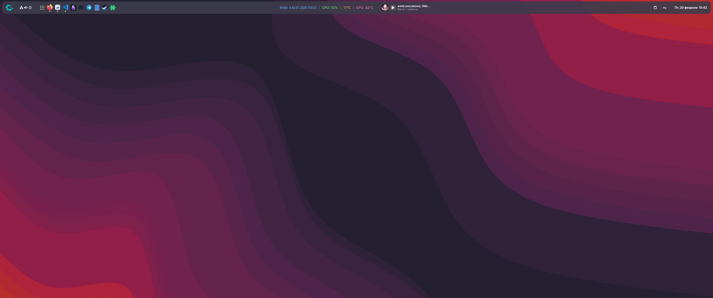

# Сетап GNOME, сюда буду выкладывать свои расширения, темы, и т.д.

## Расширение "Custom Panel Reforged"
Изменяет классическую верхнюю панель, позволяет задать ей цвет отступы, прозрачность, добавляет на нее приложения, монитор системных ресурсов и плеер. 

## Полезные расширения:
1. Arc Menu - Меню похожее на "пуск" в windows
2. Clipboard indicator - Менеджер истории буфера обмена
3. Proxy Switcher - Настойки прокси в системном меню